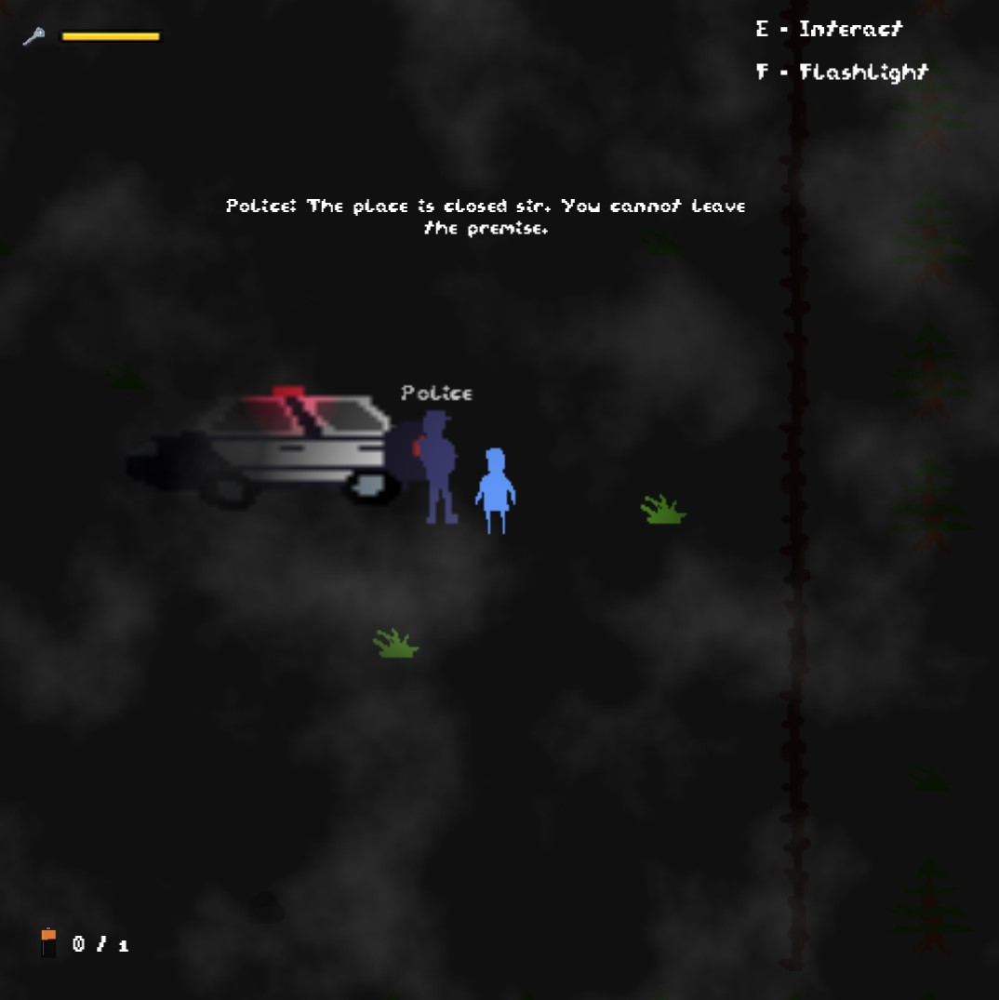

# Faith Beyond Repair

Faith Beyond Repair is a 2D top-down horror game inspired by classic minimalist horror titles like Faith and Alan Wake. Set in a desolate, eerie world, the game plunges players into a nightmarish environment where reality is fragile, and survival depends on navigating the broken boundaries between truth and deception. Armed with a flickering flashlight and a few cryptic dialogues, you must uncover the dark secrets of a haunted town that twists and distorts with every step.

Play now at Itch.io: [Link](https://rahuldshetty.itch.io/faith-beyond-repair)

## Screenshots

